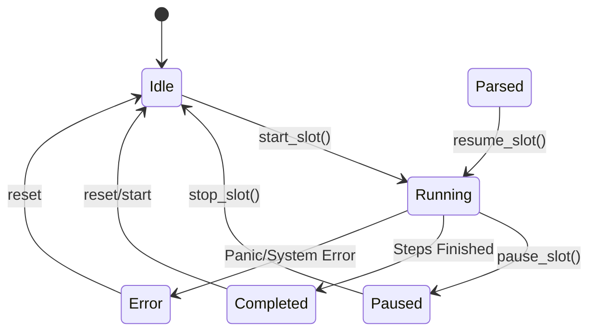

# Catalyst 引擎技术架构文档 (Engine Technical Architecture)

**生效日期**: 2026-01-13
**版本**: 3.0
**状态**: MVP Complete

## 1. 系统概述

Catalyst Engine 是整个自动化测试平台的"大脑"，负责状态管理、逻辑裁决和数据持久化。它是一个纯 Rust 编写的动态库 (`libcatalytic`)，不包含任何网络或 UI 代码，完全通过 C-FBI (Function Binary Interface) 被宿主程序加载。

**核心职责**:
1. **状态管理**: 维护所有测试槽位 (Slot) 和设备 (Device) 的运行时状态。
2. **业务逻辑**: 执行测试步骤 (Step)，解析指令返回值，进行 Pass/Fail 判定。
3. **数据中心**: 所有配置 (DeviceType/Device) 和 结果 (Result/Log) 的单一真理源 (Single Source of Truth)。

---

## 2. 核心架构

```mermaid
graph TD
    Host((Host App)) <-->|C-FFI| API[FFI Interface]
    
    subgraph Engine [Catalyst Engine (Rust)]
        API --> Control[Controller Layer]
        
        Control --> SM[Slot State Machines]
        Control --> Executor[Step Executor]
        
        Executor --> Checker[Logic Checker]
        Executor --> Parser[Response Parser]
        
        Executor <-->|Trait| Db[Storage (redb)]
        
        SM --> EventBus[Event Bus]
        EventBus -->|Callback| API
    end
```

### 2.1 模块划分

| 模块 | 路径 | 职责 |
|------|------|------|
| **Core** | `src/core/` | 核心逻辑，包括 Engine 结构体、Slot 状态机、Task 调度器。 |
| **Model** | `src/model/` | 数据结构定义 (Device, Step, Result, Status)。 |
| **FFI** | `src/ffi/` | 对外暴露的 C 接口，负责 JSON 序列化/反序列化和指针安全。 |
| **Storage** | `src/storage/` | 基于 `redb` 的持久化层，存储配置和 KV 数据。 |
| **Parser** | `src/parser/` | 负责解析设备响应 (Regex, Number, JSONPath)。 |
| **Checker** | `src/checker/` | 负责判定测试结果 (Range, Threshold, Contains)。 |

---

## 3. 核心机制

### 3.1 槽位状态机 (Slot State Machine)

每个槽位独立维护一个状态机：



- **并发模型**: Engine 内部使用 Rust 的 `Mutex` 和 `RwLock` 保证线程安全，但在业务层面，每个从 Host 发起的 FFI 调用在 Engine 内部是同步执行的（除了耗时任务通过回调异步化）。

### 3.2 步骤执行流 (Execution Flow)

当 Slot 处于 `Running` 状态时，执行器 (Executor) 按顺序处理 `TestStep`：

1. **Host-Controlled Mode**:
   - Engine 暂停当前 Step。
   - 通过 `OnHostTask` 回调通知 Host 执行特定 C# 代码。
   - 等待 Host 调用 `SubmitResult` 返回结果。
   - Engine 恢复执行。

2. **Engine-Controlled Mode**:
   - **Send**: 通过 `OnEngineTask` 回调要求 Host 发送指令给硬件（Engine 不直接操作 IO）。
   - **Wait**: 等待 Host 操作完成。
   - **Parse & Check**: Engine 收到响应后，调用 `Parser` 提取数据，调用 `Checker` 判定结果。
   - **Decision**: 根据 Pass/Fail 决定跳转或继续。

### 3.3 嵌套设备配置 (Nested Device Config)

遵循 ADR-009，Engine 存储的设备模型是嵌套的：

- **DeviceType** 是顶级聚合根。
- **DeviceInstance** 和 **Command** 属于 Type 的子实体。
- **存储**: 使用 JSON 序列化整个 DeviceType 树存储到 `redb`。
- **更新**: `AddDeviceType` 操作是原子的，全量覆盖旧配置。

### 3.4 事件驱动更新 (Event-Driven UI)

Engine 不再等待轮询，而是主动推送状态：

1. Slot 状态变更 / 变量更新。
2. 生成全量/增量 `SlotStatus` 快照 (JSON)。
3. 调用 `OnUIUpdate` FFI 回调。
4. Host 收到回调后通过 gRPC Stream 推送给 UI。

---

## 4. FFI 接口规范

所有接口均遵循 C 调用约定 (`extern "C"`).

### 4.1 字符串处理
- **输入**: `*const c_char` (UTF-8 编码)。
- **输出**: 返回 JSON 字符串指针，Host **必须** 调用 `cat_engine_free_json` 释放。

### 4.2 错误处理
- 所有函数返回 `i32` 错误码。
- `0` = Success。
- `< 0` = Error Code (如 `-1`: Invalid Param, `-2`: Internal Error)。

---

## 5. 数据存储 (Storage)

Engine 使用 `redb` (纯 Rust 嵌入式数据库) 存储数据。

**文件**: `engine.db` (位于 `work-dir/data/`)

**表结构**:
- `sys_config`: 系统配置
- `device_types`: 设备类型定义 (JSON)
- `test_steps`: 测试步骤 (JSON List) 
- `slot_bindings`: 槽位绑定关系
- `variables_{slot_id}`: 运行时变量表

---

## 6. 开发指南

### 6.1 编译
```bash
cargo build --release
# 产出: target/release/libcatalytic.dylib (或 .dll / .so)
```

### 6.2 测试
```bash
# 运行核心逻辑测试
cargo test --lib

# 运行集成测试 (模拟 Host 调用)
cargo test --test integration_full_flow
```
