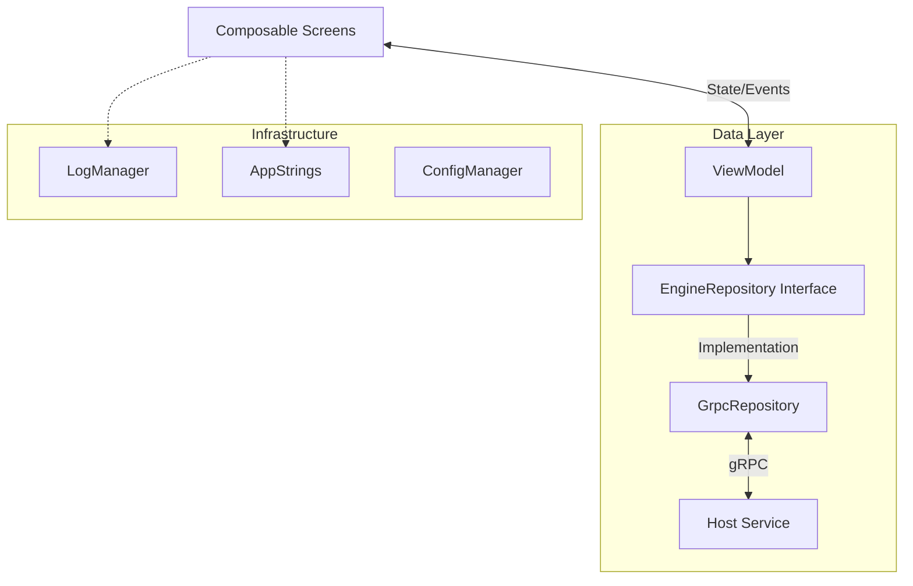

# Catalyst UI 技术架构文档 (UI Technical Architecture)

**生效日期**: 2026-01-13
**版本**: 3.0
**状态**: MVP Complete

## 1. 系统概述

Catalyst UI 是系统的用户界面层，采用 **Kotlin Compose Multiplatform** 技术构建，目标是在 Desktop (JVM) 平台上提供现代、响应式且美观的操作体验。

**核心职责**:
1. **用户交互**: 提供设备配置、测试步骤编排、测试执行控制的可视化界面。
2. **数据呈现**: 实时显示测试进度、日志、变量值和 Pass/Fail 状态。
3. **系统管控**: 负责 Host 进程的生命周期管理（启动/关闭）和端口协商。
4. **国际化**: 支持中英文多语言动态切换。

---

## 2. 核心架构

遵循 **MVVM (Model-View-ViewModel)** 架构模式。



### 2.1 模块划分

| 模块 | 路径 | 职责 |
|------|------|------|
| **UI** | `ui/screens/`, `ui/components/` | 纯 Compose 组件，无业务逻辑，通过 State 渲染，通过 Event 回调。 |
| **ViewModel** | `viewmodel/` | 持有 UI State (StateFlow)，处理业务逻辑，调用 Repository。 |
| **Model** | `model/` | 定义 UI 状态对象 (`DeviceUiState`, `SlotState`)。 |
| **Data** | `data/` | Repository 接口定义 (`EngineRepository`)。 |
| **Infrastructure** | `data/grpc/` | Repository 的 gRPC 实现，直接对接 Host。 |

---

## 3. 核心机制

### 3.1 仓库模式 (Repository Pattern)

UI 层不直接感知 gRPC 或 Engine。所有数据交互通过 `EngineRepository` 接口进行。

- **解耦**: 方便单元测试 (使用 `MockEngineRepository`) 和 UI 开发 (不依赖真实硬件)。
- **实现**: `GrpcRepository` 负责将 gRPC 的 Message/Proto 转换为 UI 友好的 Model (`Mappers.kt`)。

### 3.2 响应式数据流 (Reactive Data Flow)

采用 **Unidirectional Data Flow (UDF)**：

1. **Engine Push**: Host 通过 gRPC Stream 推送 `Event`。
2. **Repository Update**: `GrpcRepository` 接收 Event，更新内部 `MutableStateFlow`。
3. **ViewModel Observe**: ViewModel 观察 Repository 的 Flow，转换为 `UiState`。
4. **UI Render**: Compose 基于 State 自动重绘。

### 3.3 生命周期管理 (Lifecycle Management)

UI 负责 "Catalytic" 作为一个产品的完整生命周期：

1. **启动**:
   - 检查 config.json，确定工作目录。
   - 寻找可用端口 (默认 5000)。
   - 启动 Host 子进程 (`Catalytic.exe --port 5000`)。
   - 等待 Host 就绪 (gRPC Connect)。
2. **运行**: 保持 gRPC 长连接。
3. **关闭**:
   - 发送 `Shutdown` RPC 通知 Host 优雅退出。
   - 销毁 gRPC Channel。
   - 退出 UI 进程。

### 3.4 国际化 (I18n)

采用 **Type-Safe I18n** 方案：
- 定义 `AppStrings` Data Class。
- `resources/strings_en.json`, `strings_zh.json` 存储文本。
- `StringsLoader` 根据配置加载对应 JSON。
- `CompositionLocalProvider` 将 Strings 注入全局 Compose 上下文。

---

## 4. 开发指南

### 4.1 技术栈
- **Language**: Kotlin 1.9+
- **UI Framework**: Jetbrains Compose Multiplatform
- **Build System**: Gradle (Kotlin DSL)
- **Communication**: gRPC-Kotlin, Wire/Protobuf

### 4.2 编译与运行
```bash
# 运行 Desktop 应用
./gradlew run

# 运行 UI 测试
./gradlew desktopTest
```

### 4.3 关键文件
- `MainScreen.kt`: 主界面布局 (左侧导航 + 内容区域)。
- `DeviceManagementTab.kt`: 设备配置页面。
- `FlowDefinitionTab.kt`: 测试步骤编排页面 (拖拽/编辑)。
- `TestExecutionTab.kt`: 测试执行与状态监控页面。
