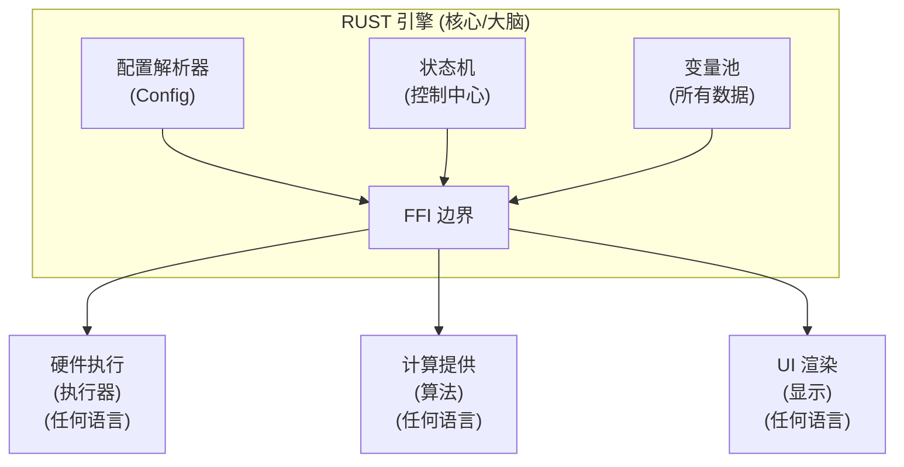
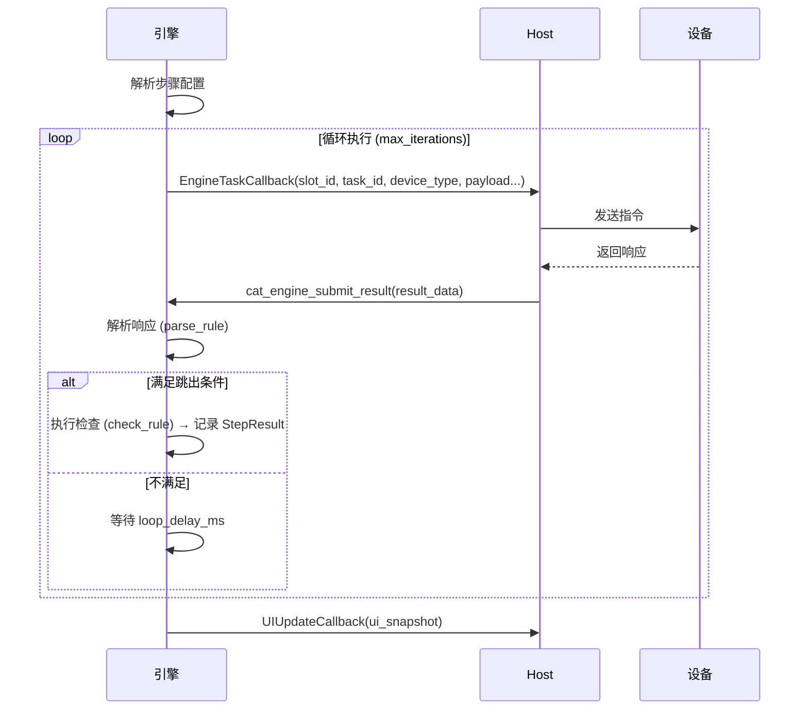
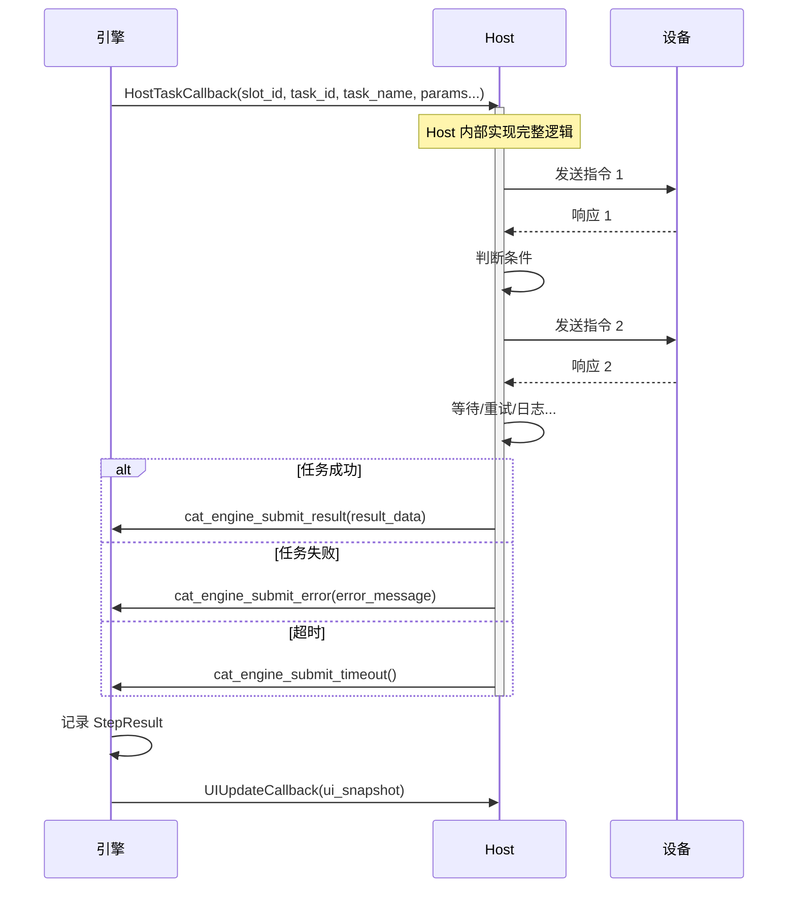
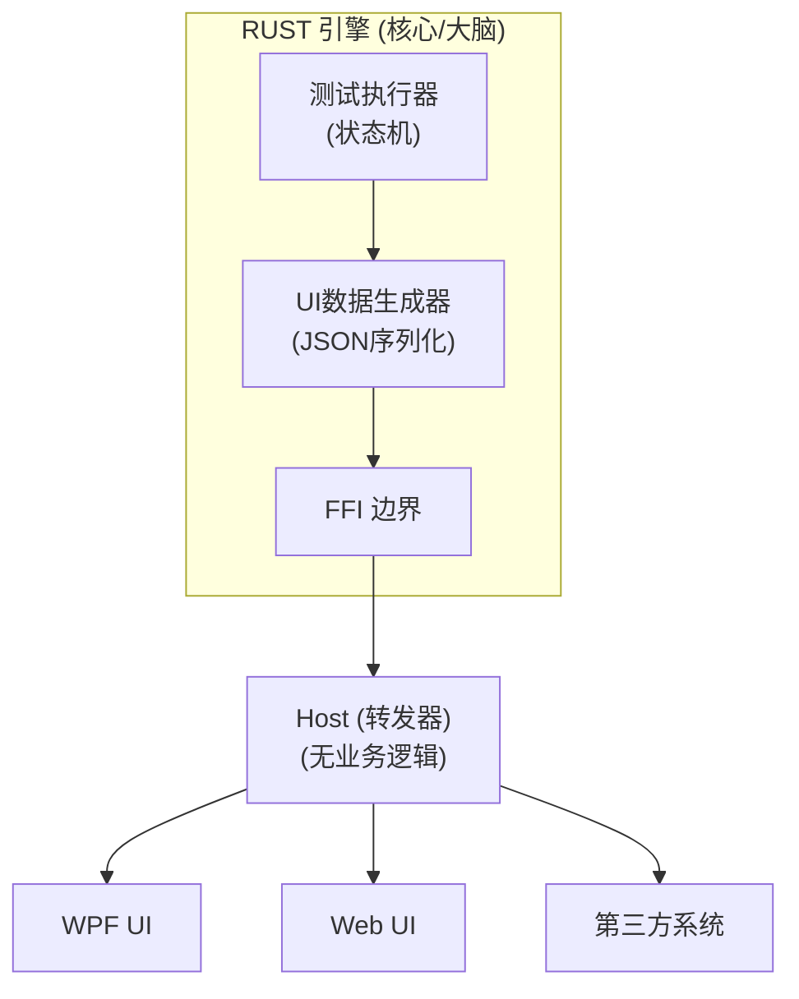
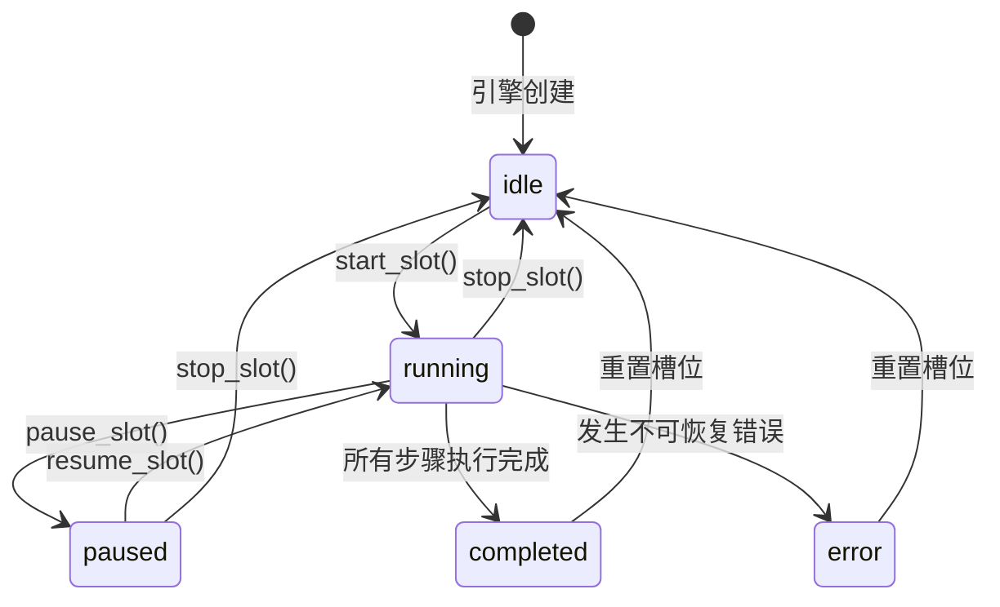

# Catalytic Engine FFI 接口规范

## 文档目的

本文档定义了 Catalytic Engine 自动化测试引擎的完整数据结构和 FFI（外部函数接口）。Rust 核心负责维护所有测试逻辑、状态和数据。外部语言（C#、Kotlin、Python 等）仅通过标准化的回调函数处理硬件通信、复杂计算和 UI 渲染。

**命名规范**：

- 正式名称：Catalytic Engine
- 导入/库名：`CatalyticEngine`
- 类型名称：`CatEngine` (C FFI 中的不透明指针类型)
- 函数前缀：`cat_engine_*` (例如：`cat_engine_create`, `cat_engine_start_slot`)


---

## 架构概览



**核心原则**：
- Rust 拥有所有数据的所有权。外部代码严禁存储任何与测试相关的状态。
- 引擎采用单例设计，但支持多槽位 (Slot) 并行执行测试。
- 每个槽位拥有独立的状态机、变量池和执行流程。
- 所有跨 FFI 的调用和回调都必须携带 `slot_id` 以区分槽位。

**多槽位使用模型**：
- 一个引擎实例管理多个槽位（在创建时通过 `cat_engine_create(slot_count)` 指定）。
- 每个槽位可以独立启动、暂停、恢复、停止（通过 `cat_engine_*_slot(engine, slot_id)` 系列函数）。
- 也可以一次性控制所有槽位（通过 `cat_engine_*_all_slots(engine)` 系列函数）。
- 典型场景：同时测试 4 个 DUT，可以全部启动，也可以只启动其中一个或几个。

---

## 核心数据结构

### 1. 引擎句柄 (不透明指针)

```c
typedef struct CatEngine CatEngine;
// 外部代码仅持有此指针，无法访问内部细节
```

### 2. 设备模型 (Device Model)

**核心概念**: 设备 = 设备类型（模板）+ 实例数组（具体设备）+ 槽位绑定

#### 2.1 设备类型（模板定义）

定义一类设备的通用配置（协议、命令格式等），包含多个物理实例。

```json
{
  "device_types": {
    "dut": {
      "name": "待测设备",
      "transport": "Serial",
      "protocol": "UDS",
      "instances": [
        {"id": "uuid_a", "name": "DUT_A", "address": "COM3"},
        {"id": "uuid_b", "name": "DUT_B", "address": "COM4"},
        {"id": "uuid_c", "name": "DUT_C", "address": "COM5"}
      ]
    },
    "scope": {
      "name": "示波器",
      "transport": "TCP",
      "protocol": "SCPI",
      "instances": [
        {"id": "uuid_s1", "name": "Scope_1", "address": "192.168.1.10"},
        {"id": "uuid_s2", "name": "Scope_2", "address": "192.168.1.11"}
      ]
    }
  }
}
```

#### 2.2 槽位设备绑定

每个槽位通过绑定表关联到具体的设备实例。

```json
{
  "slot_bindings": [
    {"slot_id": 0, "devices": {"dut": "DUT_A", "scope": "Scope_1"}},
    {"slot_id": 1, "devices": {"dut": "DUT_B", "scope": "Scope_1"}},
    {"slot_id": 2, "devices": {"dut": "DUT_C", "scope": "Scope_2"}}
  ]
}
```

**默认绑定规则**: 如果未手动配置，`slot[i]` 自动绑定到每个设备类型的 `instance[i]`。

#### 2.3 运行时解析

测试步骤中引用设备类型名，运行时通过槽位绑定解析为具体地址：

```
步骤: target_device = "dut"
  ↓
槽位0执行 → 查绑定表 → "dut" = "DUT_A"
  ↓
查实例列表 → DUT_A.address = "COM3"
  ↓
回调 Host: (slot_id=0, address="COM3", protocol="UDS", ...)
```

#### 2.4 槽位上下文 (Slot Context)

每个槽位在测试运行时持有完整的上下文信息，包括标识、绑定设备和执行结果。

**SlotContext 结构**（引擎内部，非 FFI 暴露）：

```rust
struct SlotContext {
    slot_id: u32,                           // 槽位 ID
    sn: Option<String>,                     // DUT 序列号（测试开始前由 Host 设置）
    status: SlotStatus,                     // 当前状态 (idle/running/paused/completed/error)
    
    // 设备绑定（运行时快照）
    device_bindings: HashMap<String, DeviceInstance>,  // {"dut": {id, name, address}, ...}
    
    // 执行状态
    current_step_index: u32,                // 当前执行到第几步
    start_time: Option<u64>,                // 测试开始时间戳
    
    // 变量池
    variables: HashMap<String, Variable>,   // 运行时变量（步骤间数据传递）
    
    // 步骤结果（用于生成最终报告）
    step_results: Vec<StepResult>,          // 每一步的执行结果
}
```

**StepResult 结构**：

```rust
struct StepResult {
    step_id: u32,                           // 步骤 ID
    step_name: String,                      // 步骤名称（必须保留，报告需要）
    status: StepStatus,                     // passed/failed/skipped/timeout
    elapsed_ms: u32,                        // 执行耗时
    
    // 检查结果
    final_value: Option<Value>,             // 最终检查用的值（计算后的结果）
    check_result: Option<CheckResult>,      // 检查详情（范围、阈值等）
    result_summary: String,                 // 简短摘要："3.31V (范围: 3.0-3.5V) → PASS"
    error_message: Option<String>,          // 失败/超时时的错误信息
}

struct CheckResult {
    template: String,                       // 检查模板名：range_check、threshold 等
    params: serde_json::Value,              // 检查参数：{min: 3.0, max: 3.5}
    actual: Value,                          // 实际值
    passed: bool,                           // 检查结果
}
```

**数据保留原则**：

| 数据类型 | 保留？ | 说明 |
|---------|-------|------|
| 步骤名称 | ✅ | 报告必须显示 |
| 最终检查值 | ✅ | 追溯必须有 |
| 检查结果详情 | ✅ | 追溯必须有 |
| 中间变量（默认） | ❌ | 测试结束后清空 |
| 中间变量（标记 `save_to_report: true`） | ✅ | 用户明确要求保留 |
| 原始通信字节 | ❌ | 太大，无追溯价值 |

---

### 3. 测试步骤定义 (Test Step)

**关键设计**：每个步骤都可以选择 **EngineControlled 模式**（引擎精细控制）或 **HostControlled 模式**（Host 实现业务逻辑）。

> [!NOTE]
> **说明**：以下 `TestStep` 结构体仅用于展示测试步骤的内部数据结构，**不应在 FFI 调用中使用**。
> 
> 实际使用时，通过 `cat_engine_add_test_step(engine, step_json)` 传递 JSON 字符串即可。该 JSON 应包含以下结构对应的字段。

```c
typedef struct {
    uint32_t step_id;  // 步骤 ID
    char step_name[128];  // 步骤名称

    // 执行模式选择
    char execution_mode[32];  // "engine_controlled" 或 "host_controlled"

    // EngineControlled 模式数据 (当 execution_mode="engine_controlled" 时使用)
    struct {
        char target_device[64];                // 目标设备类型名（如 "dut", "scope")
        char action_type[16];                  // "send"=仅发送, "query"=查询响应, "wait"=等待事件, "loop"=循环
        uint8_t payload[1024];                 // 发送载荷
        uint16_t payload_len;
        uint32_t timeout_ms;                   // 超时时间

        // 数据解析配置 (JSON格式)
        char parse_rule[512];                  // 解析规则: {"type": "number"} 或 {"type": "regex", "pattern": "..."}

        // 用于 Loop (循环) 动作类型
        uint32_t loop_max_iterations;          // 最大循环次数
        char break_condition[256];             // 跳出条件
        char break_pattern[256];               // 跳出匹配模式
        uint32_t loop_delay_ms;                // 循环间隔
    } engine_task;

    // HostControlled 模式数据 (当 execution_mode="host_controlled" 时使用)
    struct {
        char task_name[128];                   // 任务名称: "等待设备就绪", "自定义初始化" 等
        uint8_t params[2048];                  // JSON 格式参数
        uint16_t params_len;
        uint32_t timeout_ms;
    } host_task;

    // 公共字段 (两种模式通用)
    char save_to[64];                          // 存储结果的变量名
    char check_type[16];                       // "none"=无, "builtin"=内置检查, "external"=外部检查
    char check_rule[512];                      // 检查规则 (JSON格式)

    uint32_t next_on_pass;                     // 成功后跳转
    uint32_t next_on_fail;                     // 失败后跳转
    uint32_t next_on_timeout;                  // 超时后跳转
    uint32_t next_on_error;                    // 异常后跳转
} TestStep;
```

#### 3.1 测试步骤 JSON 示例 (完整结构)

在调用 `cat_engine_add_test_step` 时，请使用如下 JSON 结构。注意 `parse_rule` 和 `check_rule` 应当是**嵌套的 JSON 对象**，而非字符串。

**EngineControlled 模式示例**：

```json
{
  "step_id": 1,
  "step_name": "电压检测",
  "execution_mode": "engine_controlled",
  "engine_task": {
    "target_device": "dut",
    "action_type": "query",
    "payload": [34, 241, 144],
    "timeout_ms": 1000,
    "parse_rule": {
      "type": "regex", 
      "pattern": "VOLT:\\s*([0-9.]+)", 
      "group": 1
    }
  },
  "save_to": "voltage_read",
  "check_type": "builtin",
  "check_rule": {
    "template": "range_check", 
    "min": 3.0, 
    "max": 3.5
  },
  "next_on_pass": 2,
  "next_on_fail": 999
}
```

**HostControlled 模式示例**：

```json
{
  "step_id": 2,
  "step_name": "自定义初始化",
  "execution_mode": "host_controlled",
  "host_task": {
    "task_name": "WaitDeviceReady",
    "timeout_ms": 5000,
    "params": {
      "retry_interval": 500,
      "check_command": "IDN?"
    }
  },
  "next_on_pass": 3,
  "next_on_error": 999
}
```

#### 3.2 数据解析 (parse_rule)

从设备响应中提取有效数据，支持3种方式：

**1. 数字提取**

```json
{"type": "number"}
```

```
"3.3V" → 3.3
"VOLT: 3.31" → 3.31
```

**2. 正则提取**

```json
{"type": "regex", "pattern": "VOLT:\\s*([0-9.]+)", "group": 1}
```

```
"VOLT: 3.31 V" → "3.31"
```

**3. JSON 路径**

```json
{"type": "json", "path": "$.measurement.voltage"}
```

```
{"measurement": {"voltage": 3.31}} → 3.31
```

#### 3.3 检查规则 (check_rule)

支持5种预定义模板 + 简单表达式：

**模板1：范围检查**
```json
{"template": "range_check", "variable": "voltage", "min": 3.0, "max": 3.5}
```

**模板2：双变量比较**
```json
{"template": "compare", "var_a": "voltage_a", "operator": ">", "var_b": "voltage_b"}
```

**模板3：阈值检查**
```json
{"template": "threshold", "variable": "temperature", "operator": "<", "value": 85.0}
```

**模板4：字符串包含**
```json
{"template": "contains", "variable": "response", "substring": "OK"}
```

**模板5：位检查**
```json
{"template": "bit_check", "variable": "status_reg", "bit": 3, "value": 1}
```

**表达式检查**

```json
{"template": "expression", "expr": "(voltage_a + voltage_b) > 100"}
```

支持运算符: `+`, `-`, `*`, `/`, `>`, `<`, `==`, `!=`, `>=`, `<=`, `&&`, `||`

---

### 4. 变量系统 (Variable System)

```c
typedef enum {
    VAR_TYPE_INT = 0,            // 整数
    VAR_TYPE_FLOAT = 1,          // 浮点数
    VAR_TYPE_BYTES = 2,          // 字节数组
    VAR_TYPE_FLOAT_ARRAY = 3,    // 浮点数组 (波形等)
} VariableType;

typedef struct {
    VariableType type;
    union {
        int64_t int_val;
        double float_val;
        struct {
            uint8_t* data;
            uint32_t len;
        } bytes_val;
        struct {
            double* data;
            uint32_t len;
        } float_array_val;
    } value;
} Variable;
```

> [!CAUTION]
> **内存安全警告**：此结构体中的指针成员（`bytes_val.data` 和 `float_array_val.data`）**仅供 Rust 内部使用**。
> 
> 外部代码**严禁**直接访问这些指针：
> - 指针指向的内存由 Rust 管理，可能随时失效
> - 跨 FFI 边界访问会导致未定义行为（Undefined Behavior）
> 
> **正确做法**：使用 `cat_engine_get_variable_json()` 获取变量的安全快照。

---

## FFI 回调类型 (Callback Types)

### 1. EngineControlled 模式回调 (引擎控制操作)

```c
typedef int32_t (*EngineTaskCallback)(
    uint32_t slot_id,              // 槽位 ID
    uint64_t task_id,              // 唯一任务 ID
    const char* device_type,       // 设备类型名（如 "dut", "scope"）
    const char* device_address,    // 设备地址（如 "COM3", "192.168.1.10"）
    const char* protocol,          // 协议名（如 "UDS", "SCPI"）
    const char* action_type,       // "send"=仅发送, "query"=查询响应, "wait"=等待事件
    const uint8_t* payload,        // 要发送的数据
    uint32_t payload_len,
    uint32_t timeout_ms,
    void* user_data                // 用户上下文指针
);
```

- **契约**：外部代码执行 **单次** 操作后返回。引擎负责控制循环和重试逻辑。

### 2. HostControlled 模式回调 (Host 控制任务)

```c
typedef int32_t (*HostTaskCallback)(
    uint32_t slot_id,            // 槽位 ID
    uint64_t task_id,            // 唯一任务 ID
    const char* task_name,       // 任务标识符: "WaitDeviceReady" 等
    const uint8_t* params,       // 参数 (JSON 格式)
    uint32_t params_len,
    uint32_t timeout_ms,
    void* user_data              // 用户上下文指针
);
```

- **契约**：外部代码实现 **整个任务逻辑**（包括其内部的循环、重试和检查）。引擎仅跟踪任务是否完成。

### 3. 时序图

#### EngineControlled 模式时序

引擎控制循环和重试，Host 只执行单次操作：



**关键点**：
- Host 每次只执行**一次**设备交互
- 循环、延迟、条件判断都在引擎内部
- 引擎保护核心逻辑，Host 无法知道业务意图

---

#### HostControlled 模式时序

Host 全权执行任务，引擎仅等待结果：



**关键点**：
- Host 拥有**完全控制权**，可实现任意复杂逻辑
- 引擎仅记录最终结果，不参与过程
- 适用于非标准化、难以配置化的场景

---

## UI 状态通信接口

### 设计原则

UI 交互层遵循以下原则：
- **引擎是唯一的大脑**：所有 UI 显示内容由引擎生成，Host 不做任何解析或决策
- **Host 是无脑转发器**：仅负责在引擎和 UI 之间传递数据
- **UI 可任意替换**：支持任何 UI 框架（WPF、Web、Compose、嵌入第三方系统等）

### UI 数据流架构



### UI 更新回调

```c
// UI 更新回调：引擎推送 UI 数据包给 Host
typedef void (*UIUpdateCallback)(
    const char* update_json,   // JSON 格式的 UI 更新指令（包含所有槽位状态）
    uint32_t json_len,         // JSON 字符串长度
    void* user_data            // Host 的上下文指针
);

// 注册 UI 更新回调
void cat_engine_register_ui_callback(
    CatEngine* engine,
    UIUpdateCallback callback,
    void* user_data
);
```

**关键特性**：
- 每次推送包含**所有槽位**的完整状态
- Host 不解析 JSON 内容，直接转发给 UI
- UI 只需要一个状态对象，直接替换渲染
- 支持任意 UI 框架（通过 JSON 协议解耦）

---

### UI 更新消息格式

引擎采用**全局快照**模式，每次状态变化时推送所有槽位的完整状态。

#### 核心消息：全局快照 (ui_snapshot)

```json
{
  "type": "ui_snapshot",
  "timestamp": 1703567890123,
  "slots": [
    {
      "slot_id": 0,
      "sn": "ABC123456789",
      "device_bindings": {
        "dut": {"name": "DUT_A", "address": "COM3"},
        "scope": {"name": "Scope_1", "address": "192.168.1.10"}
      },
      "status": "running",
      "progress": {
        "current_step": 5,
        "total_steps": 20,
        "percent": 25,
        "elapsed_ms": 12340,
        "start_time": 1703567878000
      },
      "current_step": {
        "step_id": 123,
        "step_index": 5,
        "step_name": "电压检测",
        "status": "executing",
        "description": "正在查询 UDS 0x22 0x01 0x02...",
        "elapsed_ms": 1234,
        "error_message": null
      },
      "variables": {
        "voltage": {"value": "3.31", "unit": "V", "type": "float"},
        "temperature": {"value": "25.3", "unit": "°C", "type": "float"}
      }
    },
    {
      "slot_id": 1,
      "sn": null,
      "device_bindings": {
        "dut": {"name": "DUT_B", "address": "COM4"},
        "scope": {"name": "Scope_1", "address": "192.168.1.10"}
      },
      "status": "idle",
      "progress": null,
      "current_step": null,
      "variables": {}
    },
    {
      "slot_id": 2,
      "sn": "DEF987654321",
      "device_bindings": {
        "dut": {"name": "DUT_C", "address": "COM5"},
        "scope": {"name": "Scope_2", "address": "192.168.1.11"}
      },
      "status": "completed",
      "progress": {
        "current_step": 20,
        "total_steps": 20,
        "percent": 100,
        "elapsed_ms": 45678,
        "start_time": 1703567878000,
        "end_time": 1703567923678
      },
      "current_step": null,
      "variables": {
        "final_voltage": {"value": "3.30", "unit": "V", "type": "float"}
      }
    }
  ]
}
```

**槽位状态枚举**：
- `idle`: 空闲（未开始或已重置）
- `running`: 运行中
- `paused`: 已暂停
- `completed`: 已完成（成功或失败）
- `error`: 发生错误

**槽位状态机**：



**非法状态转换**（引擎内部拒绝）：
- `idle` → `completed`（未执行不能完成）
- `idle` → `paused`（未运行不能暂停）
- `completed` → `running`（已完成不能恢复，需重置）
- `error` → `running`（异常不能恢复，需重置）

**步骤状态枚举**：
- `waiting`: 等待执行
- `executing`: 正在执行
- `passed`: 执行成功
- `failed`: 执行失败（error_message 包含失败原因）
- `timeout`: 执行超时（error_message 包含超时详情）
- `skipped`: 已跳过


#### 补充消息类型

除了核心的 `ui_snapshot`，还有以下补充消息：

##### 1. 日志消息 (log)

日志采用增量模式（不在快照中，因为完整历史太大）：

```json
{
  "type": "log",
  "slot_id": 0,
  "level": "warning",
  "message": "设备响应超时，正在重试...",
  "timestamp": 1703567890123
}
```

**日志级别**：
- `debug`: 调试信息
- `info`: 一般信息
- `warning`: 警告
- `error`: 错误

##### 2. 测试报告 (test_report)

测试完成时的最终报告：

```json
{
  "type": "test_report",
  "slot_id": 0,
  "sn": "ABC123456789",
  "device_bindings": {
    "dut": {"name": "DUT_A", "address": "COM3"},
    "scope": {"name": "Scope_1", "address": "192.168.1.10"}
  },
  "overall_status": "passed",
  "total_steps": 20,
  "passed": 18,
  "failed": 2,
  "skipped": 0,
  "elapsed_ms": 45678,
  "start_time": 1703567890123,
  "end_time": 1703567935801,
  "steps": [
    {
      "step_id": 1,
      "step_index": 1,
      "name": "设备初始化",
      "status": "passed",
      "elapsed_ms": 1234,
      "result_summary": "初始化成功",
      "final_value": null,
      "check_result": null
    },
    {
      "step_id": 2,
      "step_index": 2,
      "name": "电压检测",
      "status": "passed",
      "elapsed_ms": 567,
      "result_summary": "3.31V (范围: 3.0-3.5V) → PASS",
      "final_value": 3.31,
      "check_result": {
        "template": "range_check",
        "params": {"min": 3.0, "max": 3.5},
        "actual": 3.31,
        "passed": true
      }
    }
  ]
}
```

---

### 快照推送时机

**全局快照采用事件驱动模式**，在以下有意义的状态变化时立即推送：

1. **测试执行事件**
   - 槽位测试开始
   - 步骤开始执行
   - 步骤完成（成功/失败/超时）
   - 槽位测试完成

2. **用户控制事件**
   - 用户暂停/恢复/停止测试
   - 用户跳过步骤

3. **数据变化事件**
   - 测试变量值更新
   - 进度百分比变化

**不推送的情况**：
- 纯粹的时间流逝（elapsed_ms 自增）
- 引擎内部状态变化但 UI 无需感知的情况

**性能优化**：
- 高频变化（如快速变量更新）会合并推送，避免短时间内多次快照
- 典型场景：10-20 步的测试序列约产生 50-100 次快照推送
- 单次快照大小：~10KB（4槽位，每槽位10个变量）

---

## FFI 接口函数

### 生命周期管理

```c
// 创建引擎实例（指定槽位数量）
CatEngine* cat_engine_create(uint32_t slot_count);

// 加载槽位配置（二进制流或 SQLite 路径）
int32_t cat_engine_load_slot_config(
    CatEngine* engine,
    uint32_t slot_id,        // 槽位 ID (0 ~ slot_count-1)
    const uint8_t* config_data,
    uint32_t config_len
);

// 销毁引擎并释放资源
void cat_engine_destroy(CatEngine* engine);
```

### 配置管理

```c
// 加载全局配置（包含资源类型、测试步骤、槽位绑定等）
int32_t cat_engine_load_config(
    CatEngine* engine,
    const char* config_json  // 完整配置的JSON字符串
);

// 获取全局配置
const char* cat_engine_get_config_json(CatEngine* engine);

// 释放引擎返回的JSON字符串
void cat_engine_free_json(const char* json);
```

**配置加载说明**：

- **`cat_engine_load_config()`**：推荐用于开发和调试阶段，通过 JSON 一次性加载完整配置
- **`cat_engine_load_slot_config()`**：推荐用于生产环境，从数据库读取二进制配置（性能更优）
- **优先级**：后调用的函数会覆盖先前的配置。建议选择其中一种方式，避免混用造成混淆


### 设备管理

```c
// 添加设备类型
int32_t cat_engine_add_device_type(
    CatEngine* engine,
    const char* type_json  // {"name": "dut", "protocol": "UDS", "transport": "Serial"}
);

// 添加设备实例
int32_t cat_engine_add_device_instance(
    CatEngine* engine,
    const char* type_name,      // 设备类型名（如 "dut"）
    const char* instance_json   // {"id": "uuid...", "name": "DUT_A", "address": "COM3"}
);

// 删除设备实例
int32_t cat_engine_remove_device_instance(
    CatEngine* engine,
    const char* type_name,
    const char* instance_id
);
```

### 测试步骤管理

```c
// 获取所有测试步骤
const char* cat_engine_get_test_steps_json(CatEngine* engine);

// 添加测试步骤
int32_t cat_engine_add_test_step(
    CatEngine* engine,
    const char* step_json  // TestStep的JSON表示
);

// 更新测试步骤
int32_t cat_engine_update_test_step(
    CatEngine* engine,
    uint32_t step_id,
    const char* step_json
);

// 删除测试步骤
int32_t cat_engine_remove_test_step(
    CatEngine* engine,
    uint32_t step_id
);

// 调整步骤顺序
int32_t cat_engine_reorder_steps(
    CatEngine* engine,
    const uint32_t* step_ids,  // 新的顺序数组
    uint32_t count
);
```

### 槽位管理

```c
// 动态设置槽位数量
int32_t cat_engine_set_slot_count(
    CatEngine* engine,
    uint32_t new_count
);
// 返回值:
//  0: 成功
// -1: 有槽位正在运行，无法调整
// -2: 参数错误

// 设置槽位设备绑定
int32_t cat_engine_set_slot_binding(
    CatEngine* engine,
    uint32_t slot_id,
    const char* bindings_json  // {"dut": "DUT_A", "scope": "Scope_1"}
);

// 获取槽位设备绑定
const char* cat_engine_get_slot_binding(
    CatEngine* engine,
    uint32_t slot_id
);

// 设置槽位的 DUT 序列号（测试开始前必须调用）
int32_t cat_engine_set_slot_sn(
    CatEngine* engine,
    uint32_t slot_id,
    const char* serial_number  // DUT 唯一序列号
);
// 返回值:
//  0: 成功
// -1: 槽位正在运行，无法修改
// -2: 参数错误（slot_id 越界或 sn 为空）

// 获取槽位的 DUT 序列号
const char* cat_engine_get_slot_sn(
    CatEngine* engine,
    uint32_t slot_id
);

// 清空槽位的 SN（测试结束后可选调用）
void cat_engine_clear_slot_sn(
    CatEngine* engine,
    uint32_t slot_id
);
```

### 回调注册

```c
// 注册 EngineControlled 模式回调
void cat_engine_register_engine_task_callback(
    CatEngine* engine,
    EngineTaskCallback callback,
    void* user_data          // 传递给回调的用户数据
);

// 注册 HostControlled 模式回调
void cat_engine_register_host_task_callback(
    CatEngine* engine,
    HostTaskCallback callback,
    void* user_data          // 传递给回调的用户数据
);

// 注册 UI 更新回调
void cat_engine_register_ui_callback(
    CatEngine* engine,
    UIUpdateCallback callback,
    void* user_data
);
```

### 测试控制

```c
// 开始执行单个槽位的测试（阻塞直到该槽位完成或停止）
int32_t cat_engine_start_slot(CatEngine* engine, uint32_t slot_id);

// 开始执行所有槽位的测试（阻塞直到所有槽位完成或停止）
// 注意：只要有任意槽位仍在运行，此函数就会阻塞
// 各槽位独立并行执行，某个槽位失败不影响其他槽位继续运行
int32_t cat_engine_start_all_slots(CatEngine* engine);

// 暂停单个槽位的测试执行
int32_t cat_engine_pause_slot(CatEngine* engine, uint32_t slot_id);

// 暂停所有槽位的测试执行
int32_t cat_engine_pause_all_slots(CatEngine* engine);

// 恢复单个槽位的测试执行
int32_t cat_engine_resume_slot(CatEngine* engine, uint32_t slot_id);

// 恢复所有槽位的测试执行
int32_t cat_engine_resume_all_slots(CatEngine* engine);

// 停止单个槽位的测试执行（可从另一线程调用）
int32_t cat_engine_stop_slot(CatEngine* engine, uint32_t slot_id);

// 停止所有槽位的测试执行（可从另一线程调用）
int32_t cat_engine_stop_all_slots(CatEngine* engine);

// 单步执行（执行一步后自动暂停）
int32_t cat_engine_step_next(CatEngine* engine, uint32_t slot_id);

// 跳过当前步骤
int32_t cat_engine_skip_current_step(CatEngine* engine, uint32_t slot_id);
```

**返回值约定**：
- `0`: 成功
- `-1`: 引擎状态不允许此操作
- `-2`: 参数错误
- `-3`: 内部错误

### 结果提交（由外部代码调用）

```c
// 提交成功的返回数据
int32_t cat_engine_submit_result(
    CatEngine* engine,
    uint32_t slot_id,        // 槽位 ID
    uint64_t task_id,
    const uint8_t* result_data,
    uint32_t result_len
);

// 提交超时通知
int32_t cat_engine_submit_timeout(
    CatEngine* engine,
    uint32_t slot_id,        // 槽位 ID
    uint64_t task_id
);

// 提交错误及异常信息
int32_t cat_engine_submit_error(
    CatEngine* engine,
    uint32_t slot_id,        // 槽位 ID
    uint64_t task_id,
    const char* error_message
);
```

### 查询接口（可选）

```c
// 获取槽位当前状态的 JSON 快照（非阻塞）
const char* cat_engine_get_slot_status_json(
    CatEngine* engine,
    uint32_t slot_id         // 槽位 ID
);

// 获取指定槽位变量的值（JSON 格式）
const char* cat_engine_get_variable_json(
    CatEngine* engine,
    uint32_t slot_id,        // 槽位 ID
    const char* var_name
);

// 释放 JSON 字符串内存
void cat_engine_free_json(const char* json);
```

**注意**：这些查询接口是可选的，因为引擎会主动推送所有状态变化。仅在特殊场景（如 UI 初始化时需要获取当前状态）使用。

---

## 执行流程示例

### EngineControlled 模式示例 (由引擎控制轮询)

**场景**：每隔 1 秒查询一次设备状态，直到就绪（最多 10 次）。

1. **引擎**：发起 `EngineTaskCallback`。
2. **外部 C#**：只执行一次指令发送和接收，返回结果。
3. **引擎**：检查结果。若不匹配，延迟 1000ms，再次发起回调。
4. **优点**：逻辑在 Rust DLL 中（受保护），开发只需配置参数。

### HostControlled 模式示例 (业务逻辑在外部代码)

**场景**：同样的轮询要求，但由开发者在 C# 中实现。

1. **引擎**：发起 `HostTaskCallback`，告诉 C#："执行 WaitDeviceReady 任务"。
2. **外部 C#**：在 C# 内部写 `for` 循环、处理异常、日志记录，直到成功。
3. **外部 C#**：调用一次 `cat_engine_submit_result` 告诉引擎最终结果。
4. **优点**：极高的灵活性，开发者可以编写复杂的业务代码。

### UI 交互示例

**场景**：UI 显示测试进度和实时状态

```csharp
// ===== Host 侧代码（完全无脑转发）=====
class TestHost {
    private CatEngine engine;
    private IUIInterface ui;
    private HardwareDriver hardwareDriver;
    
    public void Initialize(uint slotCount) {
        engine = NativeMethods.cat_engine_create(slotCount);
        
        // 注册 UI 更新回调：无脑转发
        NativeMethods.cat_engine_register_ui_callback(
            engine,
            OnUIUpdate,
            IntPtr.Zero
        );
        
        // 注册 EngineControlled 模式回调，传递 this 指针
        GCHandle handle = GCHandle.Alloc(this);
        NativeMethods.cat_engine_register_engine_task_callback(
            engine,
            OnEngineTask,
            GCHandle.ToIntPtr(handle)  // 将实例指针传递给回调
        );
        
        // 注册 HostControlled 模式回调（用于复杂业务逻辑）
        NativeMethods.cat_engine_register_host_task_callback(
            engine,
            OnHostTask,
            GCHandle.ToIntPtr(handle)  // 同样传递实例指针
        );
    }
    
    // UI 更新回调：直接转发给 UI
    private static void OnUIUpdate(IntPtr json, uint len, IntPtr userData) {
        // Host 不解析 JSON，直接转发给 UI
        // 全局快照中已包含所有槽位信息
    }
    
    // UI 操作响应：异步转发给引擎（避免阻塞 UI 线程）
    public void OnUICommand(uint slotId, string command) {
        switch(command) {
            case "start":  
                // start 是阻塞调用，在后台线程执行
                Task.Run(() => NativeMethods.cat_engine_start_slot(engine, slotId)); 
                break;
            case "pause":  
                NativeMethods.cat_engine_pause_slot(engine, slotId); 
                break;
            case "resume": 
                NativeMethods.cat_engine_resume_slot(engine, slotId); 
                break;
            case "stop":   
                NativeMethods.cat_engine_stop_slot(engine, slotId); 
                break;
        }
    }
    
    // EngineControlled 任务回调：静态方法，通过 user_data 访问实例
    private static int OnEngineTask(
        uint slotId,
        ulong taskId,
        string deviceType,       // 设备类型名，如 "dut"
        string deviceAddress,    // 设备地址，如 "COM3"
        string protocol,         // 协议名，如 "UDS"
        string actionType,       // "send", "query", "wait"
        byte[] payload,
        uint payloadLen,         // payload 数组长度
        uint timeout,
        IntPtr userData  // 接收 user_data
    ) {
        // 从 userData 恢复实例指针
        GCHandle handle = GCHandle.FromIntPtr(userData);
        TestHost instance = (TestHost)handle.Target;
        
        // 现在可以访问实例成员了，通过设备地址和协议信息执行操作
        var result = instance.hardwareDriver.Execute(deviceAddress, protocol, payload);
        NativeMethods.cat_engine_submit_result(instance.engine, slotId, taskId, result, (uint)result.Length);
        return 0;
    }
    
    // HostControlled 任务回调：处理复杂的业务逻辑
    private static int OnHostTask(
        uint slotId,
        ulong taskId,
        string taskName,
        byte[] taskParams,
        uint paramsLen,
        uint timeout,
        IntPtr userData
    ) {
        GCHandle handle = GCHandle.FromIntPtr(userData);
        TestHost instance = (TestHost)handle.Target;
        
        try {
            // 根据任务名执行不同的业务逻辑
            switch(taskName) {
                case "WaitDeviceReady":
                    // 在这里实现轮询逻辑、异常处理等
                    instance.WaitForDeviceReady(slotId, timeout);
                    break;
                case "CustomInitialization":
                    instance.PerformCustomInit(slotId, taskParams);
                    break;
                default:
                    throw new NotImplementedException($"Unknown host task: {taskName}");
            }
            
            NativeMethods.cat_engine_submit_result(instance.engine, slotId, taskId, null, 0);
            return 0;
        }
        catch (Exception ex) {
            NativeMethods.cat_engine_submit_error(instance.engine, slotId, taskId, ex.Message);
            return -1;
        }
    }
}
```

```csharp
// ===== UI 侧代码（全局快照模式）=====
class TestUI : IUIInterface {
    private UISnapshot currentSnapshot;
    
    public void ProcessUpdate(string json) {
        var message = JsonSerializer.Deserialize<dynamic>(json);
        
        switch ((string)message.type) {
            case "ui_snapshot":
                // 直接替换整个状态，UI 框架自动重新渲染
                currentSnapshot = JsonSerializer.Deserialize<UISnapshot>(json);
                break;
                
            case "log":
                // 日志是增量的，追加到日志列表
                var logEntry = JsonSerializer.Deserialize<LogMessage>(json);
                AppendLog(logEntry.slot_id, logEntry.level, logEntry.message);
                break;
                
            case "test_report":
                // 显示最终测试报告
                var report = JsonSerializer.Deserialize<TestReport>(json);
                ShowTestReport(report);
                break;
        }
    }
}

// ===== Compose UI 示例（Kotlin）=====
@Composable
fun TestEngineUI() {
    var snapshot by remember { mutableStateOf<UISnapshot?>(null) }
    
    LaunchedEffect(Unit) {
        engineHost.uiUpdates.collect { json ->
            // 解析消息
            val message = Json.parseToJsonElement(json).jsonObject
            when (message["type"]?.jsonPrimitive?.content) {
                "ui_snapshot" -> {
                    // 直接替换状态，Compose 自动重新渲染
                    snapshot = Json.decodeFromString<UISnapshot>(json)
                }
            }
        }
    }
    
    snapshot?.let { state ->
        Column {
            // 多槽位列表
            state.slots.forEach { slot ->
                SlotCard(slot)
            }
        }
    }
}

@Composable
fun SlotCard(slot: SlotState) {
    Card {
        // 槽位状态
        Text("Slot ${slot.slot_id}: ${slot.status}")
        
        // 进度条
        slot.progress?.let {
            LinearProgressIndicator(progress = it.percent / 100f)
            Text("${it.current_step}/${it.total_steps} - ${it.percent}%")
        }
        
        // 当前步骤
        slot.current_step?.let {
            Text("Step: ${it.step_name}")
            Text("Status: ${it.status}")
            it.error_message?.let { error ->
                Text("Error: $error", color = Color.Red)
            }
        }
        
        // 变量显示
        slot.variables.forEach { (name, variable) ->
            Text("$name: ${variable.value} ${variable.unit}")
        }
    }
}
```

**UI 实现优势**：
- 代码极简：只需要 1 个状态对象
- 永不不同步：每次都是完整状态
- 调试容易：每个快照就是真相
- 无需手动状态合并

---


## 核心设计决策

1. **双模式架构**：根据步骤的复杂程度，自由选择配置化（EngineControlled）或编码化（HostControlled）。

2. **数据所有权**：Rust 拥有所有测试数据。变量通过 **值传递** 跨越 FFI 边界（拷贝而非引用）。

3. **知识产权保护**：核心测试流逻辑和标准操作锁定在 Rust DLL 中（不可反编译）；非标的硬件适配可放在外部代码。

4. **异步处理**：Rust 内部使用 `tokio` 异步运行时；外部代码接收同步回调但可异步执行，完成后通知 Rust。

5. **线程安全**：引擎实例非线程安全，但 `cat_engine_stop_*` 系列函数支持跨线程紧急调用。

6. **UI 解耦设计**：
   - 引擎通过 JSON 生成所有 UI 内容
   - Host 作为无脑转发器，不包含任何业务逻辑
   - UI 可以是任何技术栈（WPF、Web、Compose、嵌入第三方系统）
   - 通过标准 JSON 协议实现完全解耦

---

## 验证清单 (Validation Checklist)

- [√] 外部代码能否在不了解测试逻辑的情况下执行硬件操作？ (是)
- [√] Rust 引擎能否在不直接访问硬件的情况下判定结果？ (是)
- [√] 变量能否从第 N 步传递到第 N+M 步？ (是)
- [√] 是否可以在任何 UI 框架中实现？ (是)
- [√] 测试是否可以从 UI 线程暂停或停止？ (是)
- [√] EngineControlled 模式是否可以处理不写代码的轮询？ (是)
- [√] 核心逻辑是否在 Rust DLL 中受到保护？ (是)
- [√] Host 是否完全无需理解业务逻辑？ (是)
- [√] UI 是否可以任意替换（WPF/Web/嵌入式）？ (是)
- [√] 引擎是否完全控制所有 UI 显示内容？ (是)

---

## 扩展性考虑

### 未来可能的 UI 更新类型

```json
// 实时图表更新
{
  "type": "chart_update",
  "slot_id": 0,
  "chart_id": "voltage_trend",
  "series": "voltage",
  "data_point": {
    "x": 1703567890123,
    "y": 3.31
  }
}

// 自定义控件更新
{
  "type": "custom_widget",
  "slot_id": 0,
  "widget_id": "device_status_panel",
  "html_content": "<div>...</div>",
  "data": { ... }
}

// 多媒体内容
{
  "type": "media_update",
  "slot_id": 0,
  "media_type": "image",
  "source": "base64_encoded_image_data",
  "caption": "设备外观检查照片"
}
```

所有新增的 UI 更新类型只需：
1. 在引擎侧生成对应的 JSON
2. 在 UI 侧添加解析和渲染逻辑
3. Host 无需任何改动（继续无脑转发）

---

## 内存管理规范

### 内存所有权规则

1. **引擎创建的数据**：
   - 通过 FFI 传递给 Host 的指针（如 `cat_engine_get_slot_status_json` 返回的字符串）
   - 必须由 Host 调用对应的 `cat_engine_free_json` 函数释放

2. **Host 传递的数据**：
   - 传递给引擎的数据（如 `cat_engine_submit_result` 的 `result_data`）
   - 引擎会立即拷贝，Host 可在调用返回后立即释放

3. **回调中的数据**：
   - 回调函数参数中的指针（如 `UIUpdateCallback` 的 `update_json`）
   - 仅在回调函数执行期间有效
   - Host 必须在回调内完成所有必要的数据拷贝

### 示例

```csharp
// 正确：立即拷贝回调数据 (使用 UTF-8 防止中文乱码)
private void OnUIUpdate(IntPtr json, uint len, IntPtr userData) {
    string copy = Marshal.PtrToStringUTF8(json, (int)len);  // 立即拷贝
    ui.ProcessUpdate(copy);  // 使用拷贝后的数据
}

// 错误：保存指针供后续使用
private IntPtr savedJson;  // ❌ 错误
private void OnUIUpdate(IntPtr json, uint len, IntPtr userData) {
    savedJson = json;  // ❌ 回调结束后指针失效
}

// 正确：查询接口返回的数据需要显式释放
IntPtr statusJsonPtr = NativeMethods.cat_engine_get_slot_status_json(engine, 0);
string statusJson = Marshal.PtrToStringUTF8(statusJsonPtr);
var status = JsonSerializer.Deserialize<Status>(statusJson);
NativeMethods.cat_engine_free_json(statusJsonPtr);  // 必须释放
```

---

## 线程安全说明

### 线程模型

1. **引擎执行线程**：
   - `cat_engine_start_slot()` 会阻塞调用线程，直到该槽位测试完成
   - `cat_engine_start_all_slots()` 会阻塞调用线程，直到所有槽位测试完成
   - 建议在独立线程调用 `cat_engine_start_*()` 函数

2. **控制调用线程**：
   - `cat_engine_start_slot/pause_slot/resume_slot/stop_slot/step_next` 可从任意线程调用
   - `cat_engine_start_all_slots/pause_all_slots/resume_all_slots/stop_all_slots` 可从任意线程调用
   - 内部使用原子操作和通道通信保证线程安全

3. **查询调用线程**：
   - `cat_engine_get_*` 查询函数可从任意线程调用
   - 内部使用读写锁保护共享状态

### 多槽位并发模型

- **每个槽位在独立线程中执行**：调用 `cat_engine_start_all_slots()` 后，引擎内部为每个槽位创建独立的执行线程
- **回调可能并发触发**：不同槽位的回调可能在不同线程同时触发，Host 实现需要做好线程安全保护
- **单槽位回调串行**：同一槽位的回调保证在单线程串行执行，不会出现竞争条件

**Host 线程安全建议**：
- 如果硬件驱动层是线程安全的，回调函数可以直接执行
- 如果需要访问共享资源（如 UI 组件），需要在回调中做线程同步
- 建议为每个槽位分配独立的物理资源，避免资源竞争

### 资源共享策略

- **引擎不管理资源互斥**：如果多个槽位的测试步骤引用相同的资源类型（如都使用 "dut"），引擎会并发调用 `EngineTaskCallback`
- **Host 负责资源锁**：外部代码需要在硬件驱动层实现互斥机制，确保对物理设备的访问是线程安全的
- **推荐实践**：为每个槽位分配独立的物理资源（例如槽位 0 使用 COM1，槽位 1 使用 COM2），避免共享带来的复杂性

### 推荐使用模式

```csharp
// 引擎执行线程（启动所有槽位）
Task.Run(() => {
    NativeMethods.cat_engine_start_all_slots(engine);  // 阻塞直到测试完成
});

// 或者单独启动某个槽位
Task.Run(() => {
    NativeMethods.cat_engine_start_slot(engine, 0);  // 启动槽位 0
});

// UI 线程
buttonPause.Click += (s, e) => {
    uint slotId = GetCurrentSlotId();  // 获取当前选中的槽位
    NativeMethods.cat_engine_pause_slot(engine, slotId);  // 跨线程安全调用
};

// UI 更新回调（在引擎执行线程）
private void OnUIUpdate(IntPtr json, uint len, IntPtr userData) {
    // 立即拷贝数据 (Rust 字符串默认为 UTF-8)
    string jsonStr = Marshal.PtrToStringUTF8(json, (int)len);
    // 需要切换到 UI 线程更新界面
    Dispatcher.Invoke(() => {
        ui.ProcessUpdate(jsonStr);
    });
}
```