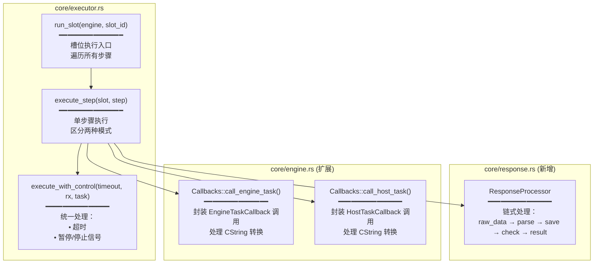
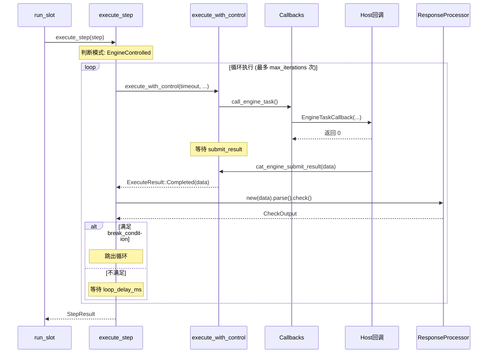
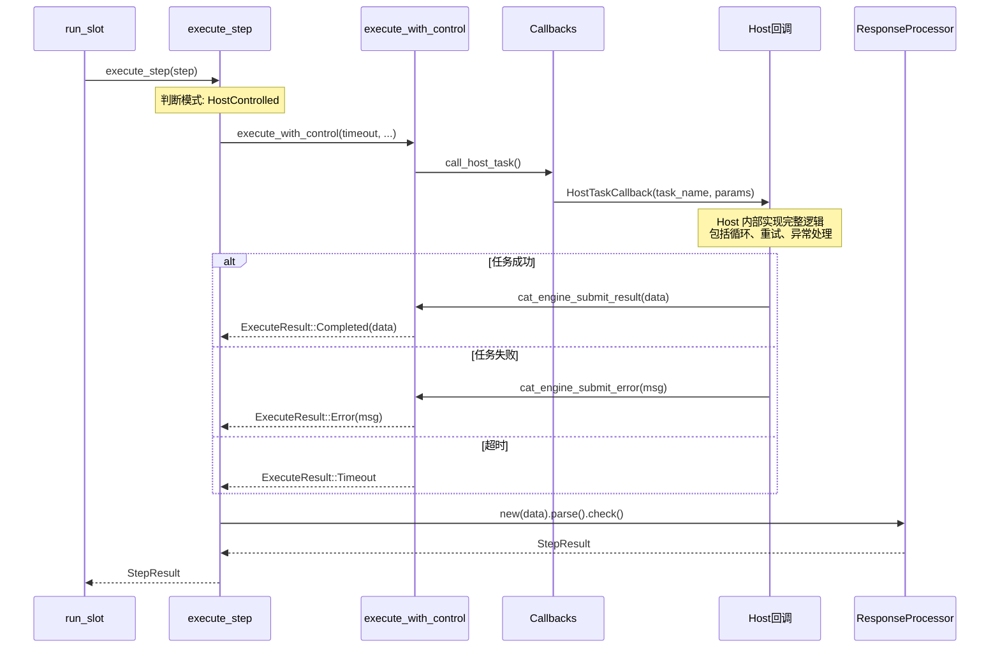
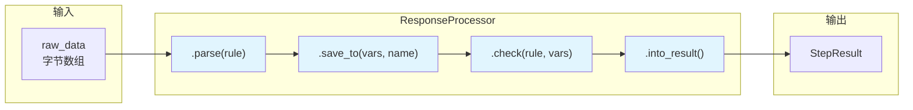

# 执行器精简方案设计图

## 1. 模块结构图



---

## 2. 类/结构体设计

```mermaid
classDiagram
    class run_slot {
        <<函数>>
        +run_slot(engine, slot_id) Result~()~
        遍历 test_steps
        调用 execute_step
        处理跳转逻辑
    }

    class execute_step {
        <<函数>>
        +execute_step(slot, step, callbacks) StepResult
        if EngineControlled → call_engine_task
        if HostControlled → call_host_task
        使用 ResponseProcessor 处理结果
    }

    class execute_with_control {
        <<泛型函数>>
        +execute_with_control~T~(timeout_ms, control_rx, future) ExecuteResult~T~
        tokio::select! 同时等待:
        - 任务完成
        - 超时
        - 控制信号
    }

    class ResponseProcessor {
        -data: Vec~u8~
        -parsed: Option~Variable~
        +new(data) Self
        +parse(rule: Option~ParseRule~) Result~Self~
        +save_to(vars, name) Self
        +check(rule, vars) Result~CheckOutput~
        +into_result(step_id, name, elapsed) StepResult
    }

    class ExecuteResult {
        <<枚举>>
        Completed~T~: 任务完成
        Timeout: 超时
        Signal~ControlSignal~: 收到控制信号
    }

    class Callbacks {
        +call_engine_task(slot_id, task, device) i32
        +call_host_task(slot_id, task) i32
        内部处理 CString 指针转换
    }
```



---

## 3. 执行流程（EngineControlled 模式）



---

## 4. 执行流程（HostControlled 模式）



---

## 5. ResponseProcessor 链式调用示例



**代码示例**：

```rust
// 传统写法（繁琐）
let parsed = parse_response(&data, &rule)?;
variables.set(&save_to, parsed.clone());
let check_output = execute_check(&check_rule, Some(&parsed), &variables)?;
let result = StepResult::from_check(step_id, step_name, elapsed, check_output);

// 链式写法（清晰）
let result = ResponseProcessor::new(data)
    .parse(&step.engine_task.as_ref().and_then(|t| t.parse_rule.as_ref()))?
    .save_to(&mut slot.variables, &step.save_to)
    .check(&step.check_rule, &slot.variables)?
    .into_result(step.step_id, &step.step_name, elapsed);
```

---

## 6. 文件变更汇总

| 文件 | 操作 | 行数变化 | 说明 |
|------|------|---------|------|
| `core/executor.rs` | 重写 | 14 → ~120 | 主执行逻辑 |
| `core/response.rs` | **新增** | ~50 | ResponseProcessor |
| `core/engine.rs` | 扩展 | +~40 | Callbacks 方法 |
| `core/mod.rs` | 修改 | +1 | 导出 response 模块 |
| **总计** | | **+~210** | |

---

## 7. 对照分析：与已完成代码的兼容性

### ✅ 可直接复用的已有代码

| 模块 | 函数/结构 | 用途 |
|------|----------|------|
| `parser/mod.rs` | `parse_response(data, rule)` | 解析响应数据 |
| `checker/mod.rs` | `execute_check(rule, value, vars)` | 执行检查规则 |
| `checker/mod.rs` | `CheckOutput` | 检查结果结构 |
| `model/result.rs` | `StepResult::passed/failed/timeout/skipped` | 结果工厂方法 |
| `model/result.rs` | `CheckResultDetail` | 检查详情 |
| `core/slot.rs` | `SlotContext.variables` (VariablePool) | 变量存取 |
| `core/slot.rs` | `ControlSignal` | 控制信号枚举 |
| `core/engine.rs` | `Callbacks` | 回调结构体 |

### ✅ 无冲突，设计方案兼容

| 设计方案组件 | 已有代码 | 兼容性 |
|-------------|---------|--------|
| `ResponseProcessor.parse()` | 调用 `parser::parse_response()` | ✅ 复用 |
| `ResponseProcessor.check()` | 调用 `checker::execute_check()` | ✅ 复用 |
| `ResponseProcessor.into_result()` | 使用 `StepResult::*()` 工厂方法 | ✅ 复用 |
| `Callbacks::call_*()` | 扩展已有 `Callbacks` 结构 | ✅ 兼容 |
| `execute_with_control()` | 使用 `SlotContext.control_rx` | ✅ 兼容 |

### 🔄 ResponseProcessor 简化方案

分析后发现：`ResponseProcessor` 可以进一步简化！

**原设计**：50 行独立结构
**优化方案**：改为**辅助函数**，约 25 行

```rust
// 不需要单独的 struct，用函数即可
fn process_response(
    data: Vec<u8>,
    parse_rule: &Option<ParseRule>,
    save_to: &Option<String>,
    check_rule: &Option<CheckRule>,
    variables: &mut VariablePool,
) -> Result<(Option<Variable>, Option<CheckOutput>)>
```

**原因**：
1. `parse_response` 和 `execute_check` 已经是完整实现
2. 只需要一个函数串联它们，不需要状态管理

### 📋 最终代码变更清单

| 文件 | 操作 | 行数 | 说明 |
|------|------|------|------|
| `core/executor.rs` | 重写 | ~100 | 主执行逻辑 |
| `core/engine.rs` | +方法 | +30 | `Callbacks::call_*()` |
| `core/mod.rs` | 无改动 | 0 | 不需要新模块 |
| **总计** | | **~130** | 比原计划少 80 行 |

### ✅ 与设计文档一致性检查

| 设计文档要求 | 实现方案 | 状态 |
|-------------|---------|------|
| EngineControlled: 引擎控制循环 | `execute_engine_task()` 内部循环 | ✅ |
| HostControlled: Host 控制全流程 | `execute_host_task()` 单次调用 | ✅ |
| 超时处理 | `tokio::select!` + `timeout_ms` | ✅ |
| 暂停/停止信号 | `control_rx.recv()` | ✅ |
| 数据解析 | 复用 `parser::parse_response()` | ✅ |
| 检查规则 | 复用 `checker::execute_check()` | ✅ |
| 变量存储 | `slot.variables.set()` | ✅ |
| 步骤跳转 | `next_on_pass/fail/timeout/error` | ✅ |
| UI 更新 | `Callbacks.ui_update` | ✅ |
