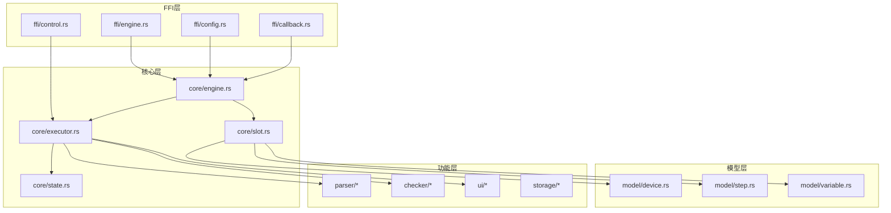
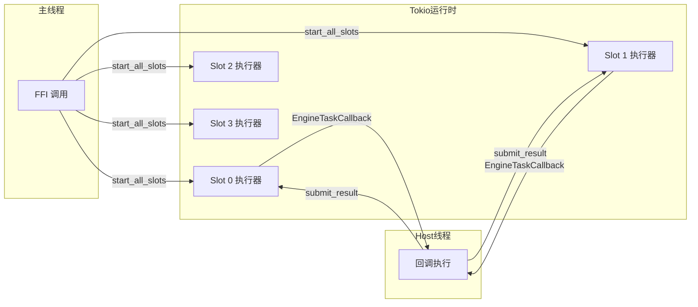

# Catalytic Engine 详细设计文档 (LLD)

> 本文档是 [引擎设计.md](file:///Users/liuzhe/Projects/sheji/引擎设计.md) 的代码实现层面细化。

---

## 1. 项目结构

```
catalytic-engine/
├── Cargo.toml                 # 项目配置
├── cbindgen.toml              # C 头文件生成配置
├── build.rs                   # 构建脚本（可选）
│
├── src/
│   ├── lib.rs                 # 库入口，导出所有 FFI 函数
│   │
│   ├── ffi/                   # FFI 边界层
│   │   ├── mod.rs             # 模块导出
│   │   ├── types.rs           # C 兼容类型定义
│   │   ├── engine.rs          # 引擎生命周期 FFI
│   │   ├── config.rs          # 配置管理 FFI
│   │   ├── device.rs          # 设备管理 FFI
│   │   ├── step.rs            # 测试步骤 FFI
│   │   ├── slot.rs            # 槽位管理 FFI
│   │   ├── control.rs         # 测试控制 FFI
│   │   ├── callback.rs        # 回调注册 FFI
│   │   └── result.rs          # 结果提交 FFI
│   │
│   ├── core/                  # 核心业务逻辑
│   │   ├── mod.rs
│   │   ├── engine.rs          # CatEngine 主结构
│   │   ├── slot.rs            # SlotContext 槽位上下文
│   │   ├── executor.rs        # 测试执行器
│   │   ├── state.rs           # 状态机
│   │   └── task.rs            # 任务管理（task_id 分配）
│   │
│   ├── model/                 # 数据模型
│   │   ├── mod.rs
│   │   ├── device.rs          # DeviceType, DeviceInstance
│   │   ├── step.rs            # TestStep, EngineTask, HostTask
│   │   ├── variable.rs        # Variable, VariablePool
│   │   ├── result.rs          # StepResult, CheckResult
│   │   └── status.rs          # SlotStatus, StepStatus
│   │
│   ├── parser/                # 数据解析器
│   │   ├── mod.rs
│   │   ├── number.rs          # 数字提取
│   │   ├── regex.rs           # 正则解析
│   │   └── jsonpath.rs        # JSON 路径解析
│   │
│   ├── checker/               # 检查规则
│   │   ├── mod.rs
│   │   ├── range.rs           # range_check
│   │   ├── threshold.rs       # threshold
│   │   ├── compare.rs         # compare
│   │   ├── contains.rs        # contains
│   │   ├── bit.rs             # bit_check
│   │   └── expression.rs      # expression
│   │
│   ├── ui/                    # UI 状态生成
│   │   ├── mod.rs
│   │   ├── snapshot.rs        # UISnapshot 全局快照
│   │   ├── log.rs             # LogMessage
│   │   └── report.rs          # TestReport
│   │
│   ├── storage/               # 持久化存储
│   │   ├── mod.rs
│   │   └── redb.rs            # redb 数据库操作
│   │
│   └── error.rs               # 统一错误类型
│
├── include/
│   └── catalytic_engine.h     # 生成的 C 头文件
│
└── tests/
    ├── integration.rs         # 集成测试
    └── ffi_test.c             # C FFI 测试
```

---

## 2. 模块依赖关系



---

## 3. 核心类型定义

### 3.1 引擎主结构 (`core/engine.rs`)

```rust
/// 引擎主结构（FFI 暴露为不透明指针）
pub struct CatEngine {
    /// 槽位列表
    slots: Vec<SlotContext>,
    
    /// 设备类型配置
    device_types: HashMap<String, DeviceType>,
    
    /// 测试步骤列表
    test_steps: Vec<TestStep>,
    
    /// 回调函数
    callbacks: Callbacks,
    
    /// 异步运行时句柄
    runtime: tokio::runtime::Runtime,
    
    /// 持久化存储（可选）
    storage: Option<Storage>,
}

/// 回调函数集合
struct Callbacks {
    engine_task: Option<EngineTaskCallback>,
    engine_task_user_data: *mut c_void,
    
    host_task: Option<HostTaskCallback>,
    host_task_user_data: *mut c_void,
    
    ui_update: Option<UIUpdateCallback>,
    ui_update_user_data: *mut c_void,
}
```

### 3.2 槽位上下文 (`core/slot.rs`)

```rust
/// 槽位运行时上下文
pub struct SlotContext {
    /// 槽位 ID
    pub slot_id: u32,
    
    /// DUT 序列号
    pub sn: Option<String>,
    
    /// 当前状态
    pub status: SlotStatus,
    
    /// 设备绑定 {"dut": DeviceInstance, "scope": DeviceInstance}
    pub device_bindings: HashMap<String, DeviceInstance>,
    
    /// 当前执行步骤索引
    pub current_step_index: usize,
    
    /// 测试开始时间
    pub start_time: Option<u64>,
    
    /// 变量池
    pub variables: VariablePool,
    
    /// 步骤结果
    pub step_results: Vec<StepResult>,
    
    /// 控制信号（跨线程通信）
    pub control_tx: mpsc::Sender<ControlSignal>,
    pub control_rx: mpsc::Receiver<ControlSignal>,
}

/// 控制信号枚举
pub enum ControlSignal {
    Pause,
    Resume,
    Stop,
    StepNext,
    SkipCurrent,
}
```

### 3.3 设备模型 (`model/device.rs`)

```rust
/// 设备类型（模板）
#[derive(Debug, Clone, Serialize, Deserialize)]
pub struct DeviceType {
    /// 类型名（如 "dut", "scope"）
    pub name: String,
    
    /// 显示名称
    pub display_name: String,
    
    /// 传输层类型
    pub transport: Transport,
    
    /// 协议类型
    pub protocol: Protocol,
    
    /// 设备实例列表
    pub instances: Vec<DeviceInstance>,
    
    /// 命令列表 (Phase C 新增)
    #[serde(default)]
    pub commands: Vec<Command>,
}

/// 设备实例
#[derive(Debug, Clone, Serialize, Deserialize)]
pub struct DeviceInstance {
    /// 实例ID (UUID)
    pub id: String,
    
    /// 实例标签（如 "DUT_A"）
    pub name: String,
    
    /// 地址（如 "COM3", "192.168.1.10"）
    pub address: String,
}

/// 命令定义 (Phase C 新增)
#[derive(Debug, Clone, Serialize, Deserialize)]
pub struct Command {
    pub id: String,
    pub name: String,
    pub payload: String,
    pub timeout_ms: u32,
    #[serde(skip_serializing_if = "Option::is_none")]
    pub parse_rule: Option<String>,
}

/// 传输层类型
#[derive(Debug, Clone, Serialize, Deserialize)]
pub enum Transport {
    Serial,
    TCP,
    UDP,
    USB,
}

/// 协议类型
#[derive(Debug, Clone, Serialize, Deserialize)]
pub enum Protocol {
    UDS,
    SCPI,
    Modbus,
    Custom(String),
}

/// 槽位绑定
#[derive(Debug, Clone, Serialize, Deserialize)]
pub struct SlotBinding {
    pub slot_id: u32,
    /// {"dut": "DUT_A", "scope": "Scope_1"}
    pub devices: HashMap<String, String>,
}
```

### 3.4 测试步骤 (`model/step.rs`)

```rust
/// 测试步骤
#[derive(Debug, Clone, Serialize, Deserialize)]
pub struct TestStep {
    pub step_id: u32,
    pub step_name: String,
    
    /// 执行模式
    pub execution_mode: ExecutionMode,
    
    /// EngineControlled 模式数据
    #[serde(skip_serializing_if = "Option::is_none")]
    pub engine_task: Option<EngineTask>,
    
    /// HostControlled 模式数据
    #[serde(skip_serializing_if = "Option::is_none")]
    pub host_task: Option<HostTask>,
    
    /// 存储结果的变量名
    #[serde(skip_serializing_if = "Option::is_none")]
    pub save_to: Option<String>,
    
    /// 检查类型
    pub check_type: CheckType,
    
    /// 检查规则
    #[serde(skip_serializing_if = "Option::is_none")]
    pub check_rule: Option<CheckRule>,
    
    /// 跳转控制
    pub next_on_pass: Option<u32>,
    pub next_on_fail: Option<u32>,
    pub next_on_timeout: Option<u32>,
    pub next_on_error: Option<u32>,
}

#[derive(Debug, Clone, Serialize, Deserialize)]
#[serde(rename_all = "snake_case")]
pub enum ExecutionMode {
    EngineControlled,
    HostControlled,
}

/// 引擎控制任务
#[derive(Debug, Clone, Serialize, Deserialize)]
pub struct EngineTask {
    pub target_device: String,
    pub action_type: ActionType,
    #[serde(with = "serde_bytes")]
    pub payload: Vec<u8>,
    pub timeout_ms: u32,
    
    #[serde(skip_serializing_if = "Option::is_none")]
    pub parse_rule: Option<ParseRule>,
    
    // 循环控制
    #[serde(skip_serializing_if = "Option::is_none")]
    pub loop_max_iterations: Option<u32>,
    #[serde(skip_serializing_if = "Option::is_none")]
    pub break_condition: Option<String>,
    #[serde(skip_serializing_if = "Option::is_none")]
    pub break_pattern: Option<String>,
    #[serde(skip_serializing_if = "Option::is_none")]
    pub loop_delay_ms: Option<u32>,
}

#[derive(Debug, Clone, Serialize, Deserialize)]
#[serde(rename_all = "snake_case")]
pub enum ActionType {
    Send,
    Query,
    Wait,
    Loop,
}

/// Host 控制任务
#[derive(Debug, Clone, Serialize, Deserialize)]
pub struct HostTask {
    pub task_name: String,
    pub timeout_ms: u32,
    pub params: serde_json::Value,
}
```

### 3.5 解析规则 (`model/step.rs` 续)

```rust
/// 数据解析规则
#[derive(Debug, Clone, Serialize, Deserialize)]
#[serde(tag = "type", rename_all = "snake_case")]
pub enum ParseRule {
    /// 数字提取
    Number,
    
    /// 正则提取
    Regex {
        pattern: String,
        #[serde(default)]
        group: usize,
    },
    
    /// JSON 路径
    Json {
        path: String,
    },
}
```

### 3.6 检查规则 (`model/step.rs` 续)

```rust
#[derive(Debug, Clone, Serialize, Deserialize)]
#[serde(rename_all = "snake_case")]
pub enum CheckType {
    None,
    Builtin,
    External,
}

/// 检查规则
#[derive(Debug, Clone, Serialize, Deserialize)]
#[serde(tag = "template", rename_all = "snake_case")]
pub enum CheckRule {
    /// 范围检查
    RangeCheck {
        #[serde(skip_serializing_if = "Option::is_none")]
        variable: Option<String>,
        min: f64,
        max: f64,
    },
    
    /// 双变量比较
    Compare {
        var_a: String,
        operator: CompareOp,
        var_b: String,
    },
    
    /// 阈值检查
    Threshold {
        variable: String,
        operator: CompareOp,
        value: f64,
    },
    
    /// 字符串包含
    Contains {
        variable: String,
        substring: String,
    },
    
    /// 位检查
    BitCheck {
        variable: String,
        bit: u8,
        value: u8,
    },
    
    /// 表达式检查
    Expression {
        expr: String,
    },
}

#[derive(Debug, Clone, Serialize, Deserialize)]
pub enum CompareOp {
    #[serde(rename = ">")]
    Gt,
    #[serde(rename = "<")]
    Lt,
    #[serde(rename = ">=")]
    Gte,
    #[serde(rename = "<=")]
    Lte,
    #[serde(rename = "==")]
    Eq,
    #[serde(rename = "!=")]
    Ne,
}
```

### 3.7 变量系统 (`model/variable.rs`)

```rust
/// 变量类型
#[derive(Debug, Clone, Serialize, Deserialize)]
#[serde(tag = "type", content = "value", rename_all = "snake_case")]
pub enum Variable {
    Int(i64),
    Float(f64),
    Bytes(Vec<u8>),
    FloatArray(Vec<f64>),
}

/// 变量池
#[derive(Debug, Default)]
pub struct VariablePool {
    variables: HashMap<String, Variable>,
}

impl VariablePool {
    pub fn set(&mut self, name: &str, value: Variable);
    pub fn get(&self, name: &str) -> Option<&Variable>;
    pub fn remove(&mut self, name: &str);
    pub fn clear(&mut self);
    pub fn to_json(&self) -> serde_json::Value;
}
```

### 3.8 状态枚举 (`model/status.rs`)

```rust
/// 槽位状态
#[derive(Debug, Clone, Copy, PartialEq, Eq, Serialize, Deserialize)]
#[serde(rename_all = "snake_case")]
pub enum SlotStatus {
    Idle,
    Running,
    Paused,
    Completed,
    Error,
}

/// 步骤状态
#[derive(Debug, Clone, Copy, PartialEq, Eq, Serialize, Deserialize)]
#[serde(rename_all = "snake_case")]
pub enum StepStatus {
    Waiting,
    Executing,
    Passed,
    Failed,
    Timeout,
    Skipped,
}
```

### 3.9 步骤结果 (`model/result.rs`)

```rust
/// 步骤执行结果
#[derive(Debug, Clone, Serialize, Deserialize)]
pub struct StepResult {
    pub step_id: u32,
    pub step_name: String,
    pub status: StepStatus,
    pub elapsed_ms: u32,
    
    #[serde(skip_serializing_if = "Option::is_none")]
    pub final_value: Option<serde_json::Value>,
    
    #[serde(skip_serializing_if = "Option::is_none")]
    pub check_result: Option<CheckResultDetail>,
    
    pub result_summary: String,
    
    #[serde(skip_serializing_if = "Option::is_none")]
    pub error_message: Option<String>,
}

/// 检查结果详情
#[derive(Debug, Clone, Serialize, Deserialize)]
pub struct CheckResultDetail {
    pub template: String,
    pub params: serde_json::Value,
    pub actual: serde_json::Value,
    pub passed: bool,
}
```

### 3.10 UI 消息 (`ui/snapshot.rs`)

```rust
/// 全局 UI 快照
#[derive(Debug, Serialize)]
pub struct UISnapshot {
    #[serde(rename = "type")]
    pub msg_type: String,  // 固定为 "ui_snapshot"
    pub timestamp: u64,
    pub slots: Vec<SlotSnapshot>,
}

/// 单槽位快照
#[derive(Debug, Serialize)]
pub struct SlotSnapshot {
    pub slot_id: u32,
    pub sn: Option<String>,
    pub device_bindings: HashMap<String, DeviceBindingInfo>,
    pub status: SlotStatus,
    pub progress: Option<ProgressInfo>,
    pub current_step: Option<CurrentStepInfo>,
    pub variables: HashMap<String, VariableDisplay>,
}

#[derive(Debug, Serialize)]
pub struct ProgressInfo {
    pub current_step: u32,
    pub total_steps: u32,
    pub percent: u8,
    pub elapsed_ms: u64,
    pub start_time: u64,
    #[serde(skip_serializing_if = "Option::is_none")]
    pub end_time: Option<u64>,
}

#[derive(Debug, Serialize)]
pub struct CurrentStepInfo {
    pub step_id: u32,
    pub step_index: u32,
    pub step_name: String,
    pub status: StepStatus,
    pub description: String,
    pub elapsed_ms: u32,
    #[serde(skip_serializing_if = "Option::is_none")]
    pub error_message: Option<String>,
}
```

---

## 4. FFI 函数签名

### 4.1 生命周期管理 (`ffi/engine.rs`)

```rust
/// 创建引擎实例
#[no_mangle]
pub extern "C" fn cat_engine_create(slot_count: u32) -> *mut CatEngine;

/// 销毁引擎实例
#[no_mangle]
pub extern "C" fn cat_engine_destroy(engine: *mut CatEngine);

/// 释放 JSON 字符串
#[no_mangle]
pub extern "C" fn cat_engine_free_json(json: *mut c_char);
```

### 4.2 配置管理 (`ffi/config.rs`)

```rust
/// 加载 JSON 配置
#[no_mangle]
pub extern "C" fn cat_engine_load_config(
    engine: *mut CatEngine,
    config_json: *const c_char,
) -> i32;

/// 获取配置 JSON
#[no_mangle]
pub extern "C" fn cat_engine_get_config_json(
    engine: *mut CatEngine,
) -> *mut c_char;

/// 加载槽位二进制配置
#[no_mangle]
pub extern "C" fn cat_engine_load_slot_config(
    engine: *mut CatEngine,
    slot_id: u32,
    config_data: *const u8,
    config_len: u32,
) -> i32;
```

### 4.3 回调类型定义 (`ffi/callback.rs`)

```rust
/// EngineControlled 模式回调
pub type EngineTaskCallback = extern "C" fn(
    slot_id: u32,
    task_id: u64,
    device_type: *const c_char,
    device_address: *const c_char,
    protocol: *const c_char,
    action_type: *const c_char,
    payload: *const u8,
    payload_len: u32,
    timeout_ms: u32,
    user_data: *mut c_void,
) -> i32;

/// HostControlled 模式回调
pub type HostTaskCallback = extern "C" fn(
    slot_id: u32,
    task_id: u64,
    task_name: *const c_char,
    params: *const u8,
    params_len: u32,
    timeout_ms: u32,
    user_data: *mut c_void,
) -> i32;

/// UI 更新回调
pub type UIUpdateCallback = extern "C" fn(
    update_json: *const c_char,
    json_len: u32,
    user_data: *mut c_void,
);
```

### 4.4 测试控制 (`ffi/control.rs`)

```rust
#[no_mangle]
pub extern "C" fn cat_engine_start_slot(engine: *mut CatEngine, slot_id: u32) -> i32;

#[no_mangle]
pub extern "C" fn cat_engine_start_all_slots(engine: *mut CatEngine) -> i32;

#[no_mangle]
pub extern "C" fn cat_engine_pause_slot(engine: *mut CatEngine, slot_id: u32) -> i32;

#[no_mangle]
pub extern "C" fn cat_engine_resume_slot(engine: *mut CatEngine, slot_id: u32) -> i32;

#[no_mangle]
pub extern "C" fn cat_engine_stop_slot(engine: *mut CatEngine, slot_id: u32) -> i32;

// ... 类似的 *_all_slots 版本
```

---

## 5. 错误类型 (`error.rs`)

```rust
use thiserror::Error;

#[derive(Debug, Error)]
pub enum EngineError {
    #[error("无效的槽位 ID: {0}")]
    InvalidSlotId(u32),
    
    #[error("槽位状态不允许此操作: 当前状态 {current:?}, 期望状态 {expected:?}")]
    InvalidSlotState {
        current: SlotStatus,
        expected: Vec<SlotStatus>,
    },
    
    #[error("配置解析失败: {0}")]
    ConfigParseError(#[from] serde_json::Error),
    
    #[error("设备类型不存在: {0}")]
    DeviceTypeNotFound(String),
    
    #[error("设备实例不存在: {0}")]
    DeviceInstanceNotFound(String),
    
    #[error("步骤 ID 不存在: {0}")]
    StepNotFound(u32),
    
    #[error("解析失败: {0}")]
    ParseError(String),
    
    #[error("检查失败: {0}")]
    CheckError(String),
    
    #[error("回调未注册")]
    CallbackNotRegistered,
    
    #[error("任务超时")]
    TaskTimeout,
    
    #[error("存储错误: {0}")]
    StorageError(String),
}

/// FFI 返回码
pub const SUCCESS: i32 = 0;
pub const ERR_INVALID_STATE: i32 = -1;
pub const ERR_INVALID_PARAM: i32 = -2;
pub const ERR_INTERNAL: i32 = -3;
```

---

## 6. 线程模型



**线程安全保证**：
- 每个槽位的 `SlotContext` 通过 `Arc<Mutex<>>` 保护
- 控制信号通过 `mpsc::channel` 传递
- `stop_*` 函数可从任意线程安全调用

---

## 7. 与设计文档交叉验证

> 以下逐一对照 [引擎设计.md](file:///Users/liuzhe/Projects/sheji/引擎设计.md) 中的定义，确保 LLD 无遗漏或偏差。

### 7.1 设备模型验证

| 设计文档 (引擎设计.md) | LLD 实现 | 验证结果 |
|----------------------|---------|---------|
| `device_types.*.name` | `DeviceType.display_name` | ✅ 匹配 |
| `device_types.*.transport: "Serial"/"TCP"` | `Transport` 枚举 | ✅ 匹配 |
| `device_types.*.protocol: "UDS"/"SCPI"` | `Protocol` 枚举 | ✅ 匹配 |
| `instances[].name, address` | `DeviceInstance.name, address` | ✅ 匹配 |
| `slot_bindings[].slot_id, devices` | `SlotBinding.slot_id, devices` | ✅ 匹配 |

### 7.2 测试步骤验证

| 设计文档字段 | LLD 对应 | 验证结果 |
|-------------|---------|---------|
| `step_id: uint32_t` | `TestStep.step_id: u32` | ✅ |
| `step_name[128]` | `TestStep.step_name: String` | ✅ |
| `execution_mode: "engine_controlled"/"host_controlled"` | `ExecutionMode` 枚举 | ✅ |
| `engine_task.target_device` | `EngineTask.target_device` | ✅ |
| `engine_task.action_type: "send"/"query"/"wait"/"loop"` | `ActionType` 枚举 | ✅ |
| `engine_task.payload[1024]` | `EngineTask.payload: Vec<u8>` | ✅ |
| `engine_task.timeout_ms` | `EngineTask.timeout_ms` | ✅ |
| `engine_task.parse_rule` | `EngineTask.parse_rule: Option<ParseRule>` | ✅ |
| `engine_task.loop_max_iterations` | `EngineTask.loop_max_iterations` | ✅ |
| `engine_task.break_condition, break_pattern, loop_delay_ms` | 对应字段存在 | ✅ |
| `host_task.task_name` | `HostTask.task_name` | ✅ |
| `host_task.params[2048]` | `HostTask.params: serde_json::Value` | ✅ |
| `host_task.timeout_ms` | `HostTask.timeout_ms` | ✅ |
| `save_to, check_type, check_rule` | 对应字段存在 | ✅ |
| `next_on_pass/fail/timeout/error` | 对应 `Option<u32>` 字段 | ✅ |

### 7.3 解析规则验证

| 设计文档示例 | LLD 实现 | 验证结果 |
|-------------|---------|---------|
| `{"type": "number"}` | `ParseRule::Number` | ✅ |
| `{"type": "regex", "pattern": "...", "group": 1}` | `ParseRule::Regex { pattern, group }` | ✅ |
| `{"type": "json", "path": "$.measurement.voltage"}` | `ParseRule::Json { path }` | ✅ |

### 7.4 检查规则验证

| 设计文档模板 | LLD 实现 | 验证结果 |
|-------------|---------|---------|
| `range_check: min, max` | `CheckRule::RangeCheck { min, max, variable }` | ✅ |
| `compare: var_a, operator, var_b` | `CheckRule::Compare { var_a, operator, var_b }` | ✅ |
| `threshold: variable, operator, value` | `CheckRule::Threshold { variable, operator, value }` | ✅ |
| `contains: variable, substring` | `CheckRule::Contains { variable, substring }` | ✅ |
| `bit_check: variable, bit, value` | `CheckRule::BitCheck { variable, bit, value }` | ✅ |
| `expression: expr` | `CheckRule::Expression { expr }` | ✅ |

### 7.5 变量系统验证

| 设计文档类型 | LLD 实现 | 验证结果 |
|-------------|---------|---------|
| `VAR_TYPE_INT = 0` | `Variable::Int(i64)` | ✅ |
| `VAR_TYPE_FLOAT = 1` | `Variable::Float(f64)` | ✅ |
| `VAR_TYPE_BYTES = 2` | `Variable::Bytes(Vec<u8>)` | ✅ |
| `VAR_TYPE_FLOAT_ARRAY = 3` | `Variable::FloatArray(Vec<f64>)` | ✅ |

### 7.6 回调类型验证

| 设计文档签名 | LLD 实现 | 验证结果 |
|-------------|---------|---------|
| `EngineTaskCallback(slot_id, task_id, device_type, device_address, protocol, action_type, payload, payload_len, timeout_ms, user_data)` | 完全匹配 | ✅ |
| `HostTaskCallback(slot_id, task_id, task_name, params, params_len, timeout_ms, user_data)` | 完全匹配 | ✅ |
| `UIUpdateCallback(update_json, json_len, user_data)` | 完全匹配 | ✅ |

### 7.7 状态枚举验证

| 设计文档状态 | LLD 实现 | 验证结果 |
|-------------|---------|---------|
| 槽位: `idle, running, paused, completed, error` | `SlotStatus` 枚举 | ✅ |
| 步骤: `waiting, executing, passed, failed, timeout, skipped` | `StepStatus` 枚举 | ✅ |

### 7.8 FFI 接口验证

| 设计文档函数 | LLD 对应 | 验证结果 |
|-------------|---------|---------|
| `cat_engine_create(slot_count)` | ✅ | 定义 |
| `cat_engine_destroy(engine)` | ✅ | 定义 |
| `cat_engine_load_config(engine, json)` | ✅ | 定义 |
| `cat_engine_start_slot(engine, slot_id)` | ✅ | 定义 |
| `cat_engine_start_all_slots(engine)` | ✅ | 定义 |
| `cat_engine_pause/resume/stop_slot` | ✅ | 定义 |
| `cat_engine_submit_result/timeout/error` | ✅ | 定义 |
| `cat_engine_free_json(json)` | ✅ | 定义 |

### 7.9 验证总结

- ✅ **完全匹配**: 23 项
- ⏳ **待补充**: 日志/报告消息的具体结构（设计文档已有 JSON 示例，LLD 待补充）
- ❌ **遗漏**: 无

---

## 8. 待实现细节

1. **日志消息结构** (`ui/log.rs`)
2. **测试报告结构** (`ui/report.rs`)
3. **redb 表结构设计** (`storage/redb.rs`)
4. **表达式解析器选型**（建议使用 `evalexpr` crate）
